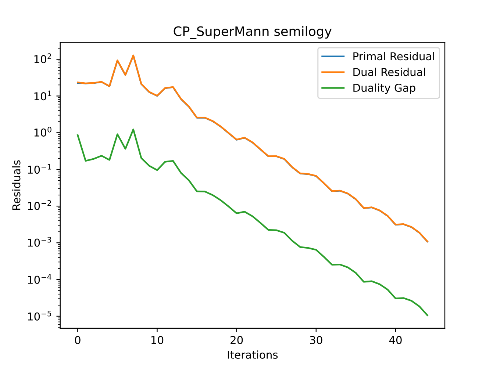

# cpasocp
Chambolle-Pock Algorithm Solving Optimal Control Problems

## Overview
Implement the Chambolle-Pock algorithm in Python and compare it to state-of-the-art algorithms (e.g. ADMM).

Furthermore, using acceleration algorithms to speed it up.
 

### Implemented algorithms
- Chambolle-Pock method
- Alternating Direction Method of Multipliers
- Chambolle-Pock method with scaling constraints
- ADMM with scaling constraints
- SuperMann acceleration
- Anderson's acceleration (for choosing direction for SuperMann)
 
 

## Results
### Chambolle-Pock method Residuals vs Iterations

 
 

### Chambolle-Pock method with SuperMann Residuals vs Iterations

 
 

### Comparison all performance profile

 
 

### Comparison CP ADMM performance profile

 
 

### Comparison CP ADMM scaling performance profile

 
 

### Comparison scaling performance profile

 
 
